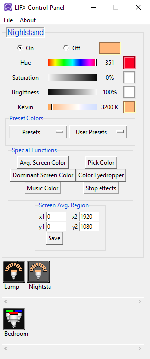

# LIFX-Control-Panel 

     
LIFX-Control-Panel is an open source application for controlling your LIFX brand lights. It integrates simple features, 
such as monitoring and changing bulb color, with more advanced ones, like:
 
 * Average Screen Color
 * Color Eyedropper
 * Custom color palette
 * Keybindings

  

#### Color Averaging Demo (Click for Video):

 

The application uses [mclarkk](https://github.com/mclarkk)'s [lifxlan](https://github.com/mclarkk/lifxlan) module to 
discover and send commands to the lights.

# Quick Start
There are ~~2~~ **3** ways to install:

1. Go over to [releases](https://github.com/samclane/LIFX-Control-Panel/releases) and download the latest `.exe` file.

2. Run `pip install lifx-control-panel`. To start run `python -m lifx_control_panel`. 

3. Head on over to [SourceForge](https://sourceforge.net/projects/lifx-control-panel/)

The `LIFX-Control-Panel-debug.exe` is a debug version that runs with a console in the background, and uses a verbose
`lifxlan` network logger.

`LIFX-Control-Panel-demo.exe` features several "Dummy" bulbs in addition to any real devices on your network. You can use
this distribution to test the software on computers that do not have a LIFX device on the LAN. 

Starting the program takes a moment, as it first must scan your LAN for any LIFX devices. 

# Running the source code
You can now install through PyPI, by running `pip install lifx-control-panel`. This will automatically install dependencies.

To manually install the dependencies, run `pip install -r requirements.txt`. PyHook3 has given me some grief installing from pip
in the past, but your millage may vary. 

To run the code from source, simply run `python gui.pyw` from the command line. To run with "Dummy" devices included, 
run `python dummy_devices.py`.

# Building
LIFX-Control-Panel uses PyInstaller. After downloading the repository, open a command window in the `LIFX-Control-Panel`
directory, and run `pyinstaller __main__.pyw`. This should generate the necessary file structure to build the project.
Note: Delete `gui.spec`, we will be using one of the following `.spec` files included in the repository:

* `main`
  * This is the file that is used to build the main binary. The console, as well as verbose logging methods, are disabled.
* `debug`
  * This spec file enables the console to run in the background, as well as verbose logging.
* `demo`
  * The demo mode simulates adding several "dummy" lights to the LAN, allowing the software to be demonstrated on networks
  that do not have any LIFX devices on them.

To build the project, simply open a command window in the same folder and run `build_all.bat` in the command prompt. It will 
call `pyinstaller` on all 3 `spec` files previously mentioned. This should generate an `.exe` in the `/dist` 
folder of the project. 

If you need help using PyInstaller, more instructions are located [here](https://pythonhosted.org/PyInstaller/usage.html).

# Testing progress
I have currently only tested on the following operating systems:
* Windows 10

and on the following LIFX devices:
* LIFX A19 Firmware v2.76
* LIFX A13 Firmware v2.76 
* LIFX Z   Firmware v1.22
* LIFX Mini White Firmware v3.41

# Feedback
If you have any comments or concerns, please feel free to make a post on the [Issues page](https://github.com/samclane/LIFX-Control-Panel/issues). 

If you enjoy LIFX-Control-Panel, please Like and leave a review on [AlternativeTo](https://alternativeto.net/software/lifx-control-panel/).

# Donate
LIFX-Control-Panel will always be free and open source. However, if you appreciate the work I'm doing and would like to 
contribute financially, you can donate below. Thanks for your support!

